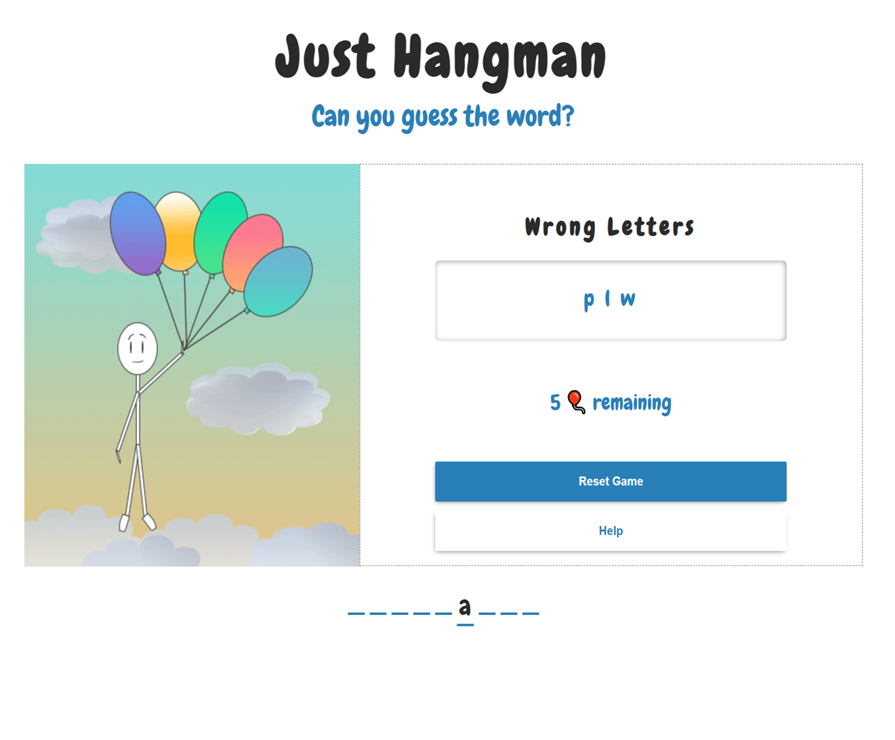
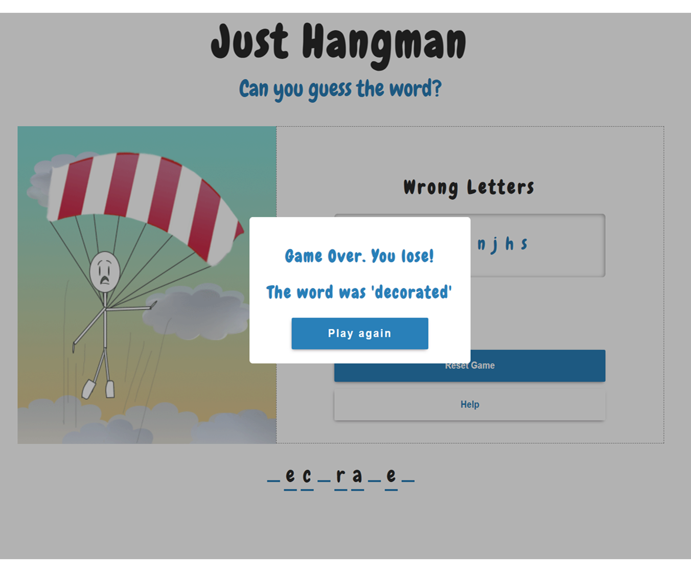

# Hangman 

A less morbid twist on the classic Hangman game. 
Built using React and Redux Toolkit. 


## How to play

Aim of the game:

Guess the correct secret word before you run out of chances. You have 8 chances to guess the correct word.

- To start a new game, click start game.
- The number of dashes represent the length of the word you have to guess.
- For each right letter you guess correctly, the letter will be added to the word.
- For each incorrect letter you guess, the letter will go into the wrong letters box and the hangman will lose a balloon.
- When there are no balloons left, you lose the game.
- If you can guess the word before you run out of balloons, you win.
- You start with 8 balloons.

## Screenshots

 

## Installation

Clone the project

```bash
  git clone https://github.com/C-Duberry/hangman.git
```

Go to the project directory

```bash
  cd hangman
```

Install dependencies

```bash
  npm install
```

Start the server

```bash
  npm run start
```


## Authors

 [Charlotte.D](https://github.com/C-Duberry)


## Acknowledgements

 - [Traversy Media](https://www.youtube.com/watch?v=jj0W8tYX_q8)


